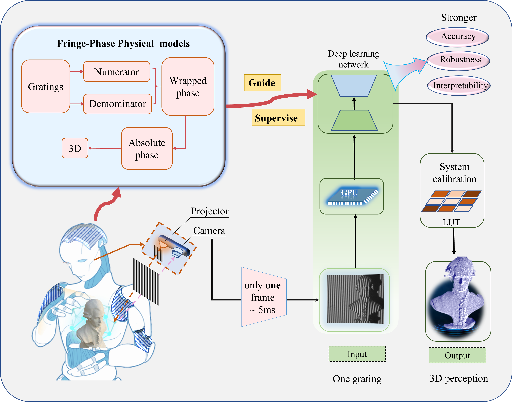
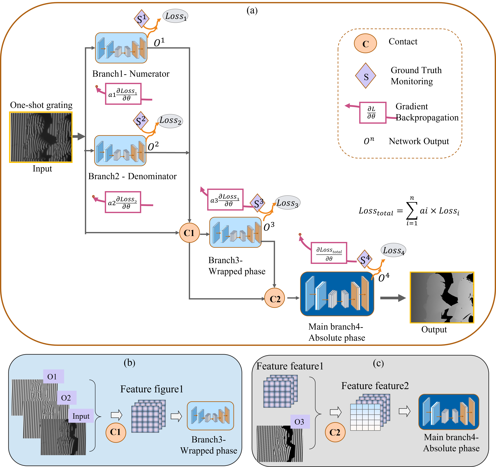
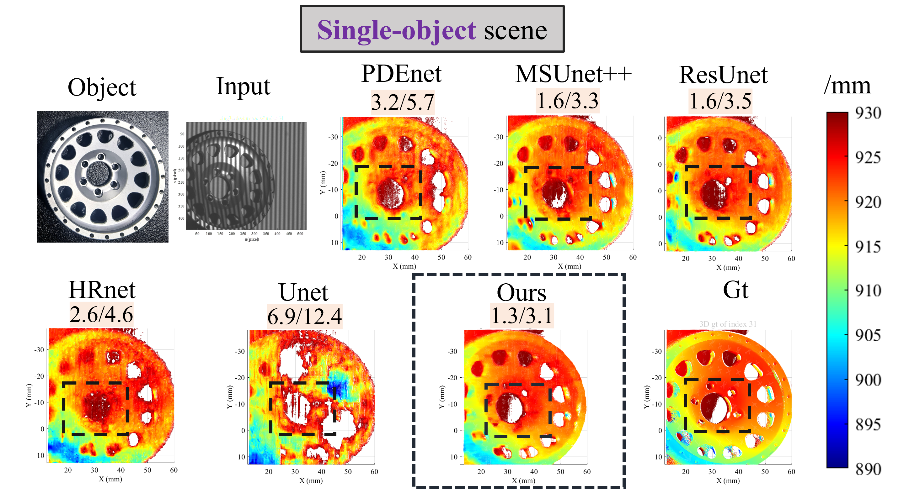

# Reliable 3D Reconstruction with Single-Shot Digital Grating and Physical Model-Supervised Machine Learning
3D reconstruction flow chart based on MPS_XNet 

 

 The network structure of MPS_XNet 
 

 
 

## 3D reconstruction effect
Prediction on metallic workpieces

Generalization to unseen objects
 

 
  

## Train

## Test
